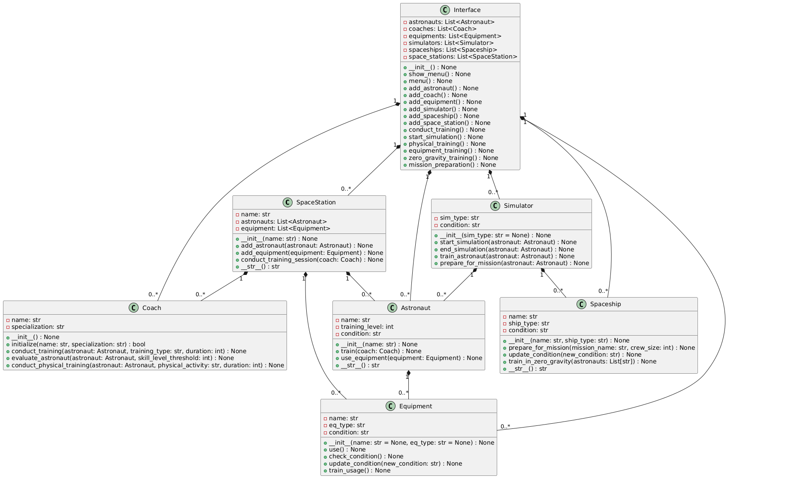
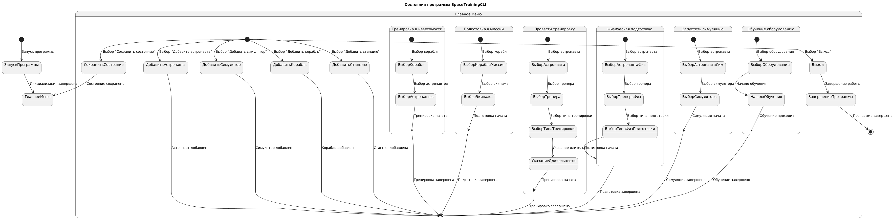

Модель обучения космонавтов
==================================

## *Главные сущности*
- ### *SpaceStation*
- ### *Spaceship*
- ### *Simulator*
- ### *Astronaut*
- ### *Coach*
- ### *Equipment*
- ### *Interface*

##  **SpaceStation** 

### **Реализует функциональность космической станции, включая управление астронавтами и оборудованием.**

### Методы:
- `add_astronaut` - добавляет астронавта на станцию.
- `add_equipment` - добавляет оборудование на станцию.
- `conduct_training_session` - проводит тренировочную сессию для астронавтов с тренером.
- `__str__` - возвращает строковое представление о станции и числе астронавтов.

---

##  **Spaceship** 

### **Представляет космический корабль, управляет его состоянием и подготовкой к миссиям.**

### Методы:
- `prepare_for_mission` - готовит корабль к миссии.
- `update_condition` - обновляет состояние корабля.
- `train_in_zero_gravity` - проводит тренировку в условиях невесомости для астронавтов.
- `__str__` - возвращает строковое представление о корабле.

---

##  **Simulator** 

### **Запускает симуляции для астронавтов и проводит тренировки.**

### Методы:
- `start_simulation` - запускает симуляцию для астронавта.
- `end_simulation` - завершает симуляцию для астронавта.
- `train_astronaut` - проводит тренировку с использованием симулятора.
- `prepare_for_mission` - готовит астронавта к миссии через симулятор.

---

##  **Astronaut** 

### **Представляет астронавта и его тренировки.**

### Методы:
- `train` - проводит тренировку с тренером.
- `use_equipment` - использует оборудование в тренировках.
- `__str__` - возвращает строковое представление о состоянии астронавта.

---

##  **Coach** 

### **Ответственен за тренировку астронавтов.**

### Методы:
- `initialize` - инициализирует тренера с его именем и специализацией.
- `conduct_training` - проводит тренировку для астронавта.
- `evaluate_astronaut` - оценивает подготовку астронавта.
- `conduct_physical_training` - проводит физическую подготовку для астронавта.
- `__str__` - возвращает строковое представление тренера.

---

##  **Equipment** 

### **Оборудование, которое используется астронавтами.**

### Методы:
- `use` - использует оборудование.
- `check_condition` - проверяет состояние оборудования.
- `update_condition` - обновляет состояние оборудования.
- `train_usage` - проводит обучение работе с оборудованием.
- `__str__` - возвращает строковое представление оборудования.

---

##  **Interface** 

### **Основной интерфейс программы для взаимодействия с пользователем.**

### Методы:
- `__validate_input` - проверяет правильность ввода пользователя.
- `show_menu` - отображает меню для выбора опций.
- `menu` - основной цикл программы для выбора действий.
- `add_astronaut` - добавляет астронавта.
- `add_coach` - добавляет тренера.
- `add_equipment` - добавляет оборудование.
- `add_simulator` - добавляет симулятор.
- `add_spaceship` - добавляет космический корабль.
- `add_space_station` - добавляет космическую станцию.
- `conduct_training` - проводит тренировку.
- `start_simulation` - запускает симуляцию для астронавта.
- `physical_training` - проводит физическую подготовку для астронавта.
- `equipment_training` - обучает работе с оборудованием.
- `zero_gravity_training` - проводит тренировку в условиях невесомости.
- `mission_preparation` - готовит астронавтов и корабль к миссии.

# Диаграммы 
### **UML-диаграмма классов:**

### **UML-диаграмма состояний:**

